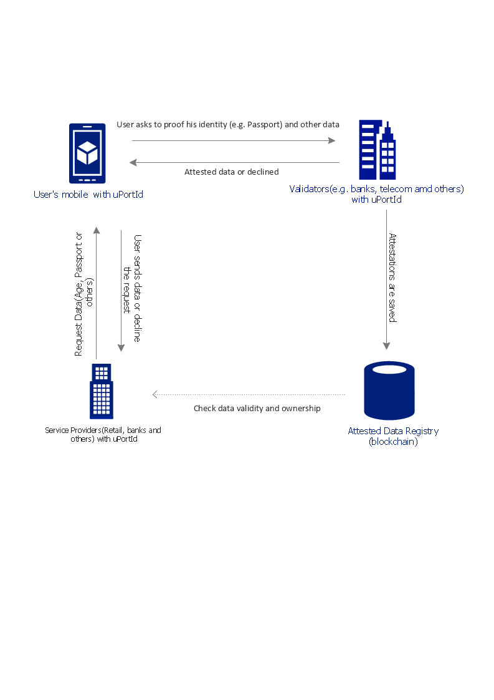

#Using uPort Identity 

uPort Mobile Application enables users to share and manage their verified identity data. 
Initially User downloads the mobile application and sets up only basic data(e.g. name). 
With uPort Identity we can build a decentrailized ecosystem which includes the following 
participants (see process/architecture.png) :
Validators (e.g. banks, telecom, government agencies and others) check and validate 
a person identity. They can also attest specific data (e.g. Bank A attests that 150 USD Credit Card Limit is provided to User).
Validator attest data and push user notifications. 
Once fully verified attestations are written by Validators to the blockchain which 
can then be used later by requestors(Service providers) of the data to verify 
the data’s authenticity and ownership.

Service Providers (retail, banks, insurance and others) are seeking to verify the same
information about a given User, and who may include other Validators, would no longer need to independently verify that 
information and could instead leverage the work already performed by trusted Validators.
An attestation gives a participant confidence in the adequacy of the process used to verify specific fields of personal 
identity with potentially greater efficiency and lower costs.

AttestedDataRegistry (smart contract) is used to keep attested data records.
Some data (e.g. passport number, passport series, address and others) is saved in AttestedDataRegistry as Merkle root hash signed by Validators.
Why using Merkle tree:
1) it enhances User control by allowing he/she to selectively reveal pieces of personal information in different circumstances. The Portions of the Merkle tree can selectively be revealed.
2) promotes security by using properties of the blockchain to prove that the data have not been tampered with after an attestation has been made
3) it doesn't reveal the underlying data
In Demo application data is saved as [client's uPortId, dataType, [validatop's uPortId, data, expDate, attestedDate] in AttestedDataRegistry.

##Benefits for Users
1) Single view of who has access to your data
2) One click registration to online services	
3) Passwordless login to websites and apps	

## Benefits for business(retail, banks, insurance and others)
1) Faster customer onboarding & product applications
2) Deeper, validated user data, direct from the customer
3) Lower the cost of KYC(Know your customer)

	
#Use case implemented	
Youtube video:  https://youtu.be/OKLib6oM_j0

##How the business process looks in our days
Alisa wants to purchase a TV and pays it by Credit Card. Before applying the store will check if her credit card is accepted or not.
Usually the store has one exclusive credit broker (e.g. works only with the bank A) to check a cardholder.
If Alisa has a credit card but it's issued by another bank. So she needs to visit the bank A to create an account and waits for days to get a credit card. 

##How it can be improved with uPort and Digital Identity
Alisa visits a bank web portal and requests to attests her data.
She comes in a bank branch for personal identification and  brings her passport (or one of the following items: Driving Licence, European Identity Card or others).
The bank validates and attests her digital identity and her requested data (Age (must be 18+), CreditCatdLimit (minimum 100 Usd)). 
The shop can works with different banks and check quickly verified credentials (Age, CreditCardLimit).
 
Please have a look at business proceess (images: process/attest.jpg, process/purchase.jpg).
An once-issued attestation like this can be used by a multitude of service-providers, dapps, and government agencies, and can potentially greatly decrease the cost of on-boarding and compliance.	

Other cases:
- Opening a bank account in other banks based on issued attestation
- Switching bank accounts

#Source Code
By default networks is 'rinkeby'. All smart contracts are deployed.
  
##Frameworks required:
* uport-js, uport-connect
* Truffle 
* Javascript
* Node.js
* Solidity
* DB (Sqllite3 , in-memory)

##Build and Deploy
###Compile add Deploy smart contracts
1.Compile and deploy contracts with the following commands:  
`truffle compile`    
`truffle migrate --network rinkeby`  

If it's successful then the output should be like this:  
Running migration: 1_initial_migration.js  
  Deploying Migrations...  
  ... 0xe3e78efef8bb9dc378b4998cb2279d9a50078e833b98f70f1d2dc610bf7c0604  
  Migrations: 0x8bb0dd94fd6e32b040f4a7934e2eabfa0aab394f  
Saving successful migration to network...  
  ... 0xa28f7fe3120838651b891d9651b3df06733bf9934dd9ec0837f706b03e5205d2
Saving artifacts...  
Running migration: 2_deploy_contracts.js  
  Deploying AttestedDataRegistry...  
  ... 0x2d7d5dca69fb775e1c17b6f98b2e4e0ed5ce1c737d6ab3eb31a362ee69d5418c  
  AttestedDataRegistry: 0x390eff51e354fa19d73f5eb9191d01ce69cb5314  
Saving successful migration to network...  
  ... 0x5945565c2ed829f277f04fc298808b202f0c8f7dcc7b75466840e2b23dca7133  
Saving artifacts...  

2.Update contract address in public/uport-admin.js (AttestedDataRegistryAddress ).
 
3.How to find a deployed smart  contract
If the contract is deployed in rinkeby
https://rinkeby.etherscan.io/address/<smart contract address>
 
###Install packages 
1.Run the command 'npm install'
 
### Run servers 

- Girafee Bank runs on http://localhost:8081/ with the command 'node girafeeBank.js' 
Public pages which are availbale to all users - http://localhost:8081/
Admin pages which are availbale to bank employees to verify and attest user data - http://localhost:8081/admin

- Panda Market runs on http://localhost:8082/ with the command 'node pandaMarket.js'

 

  